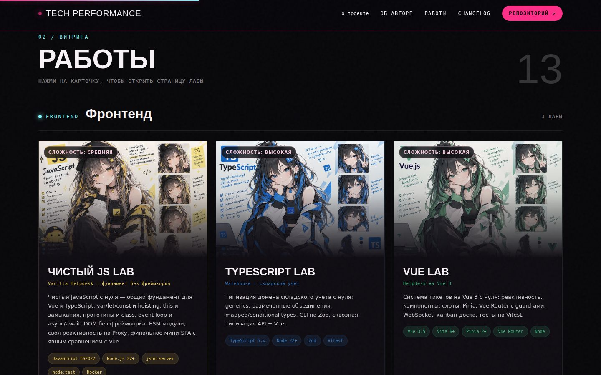
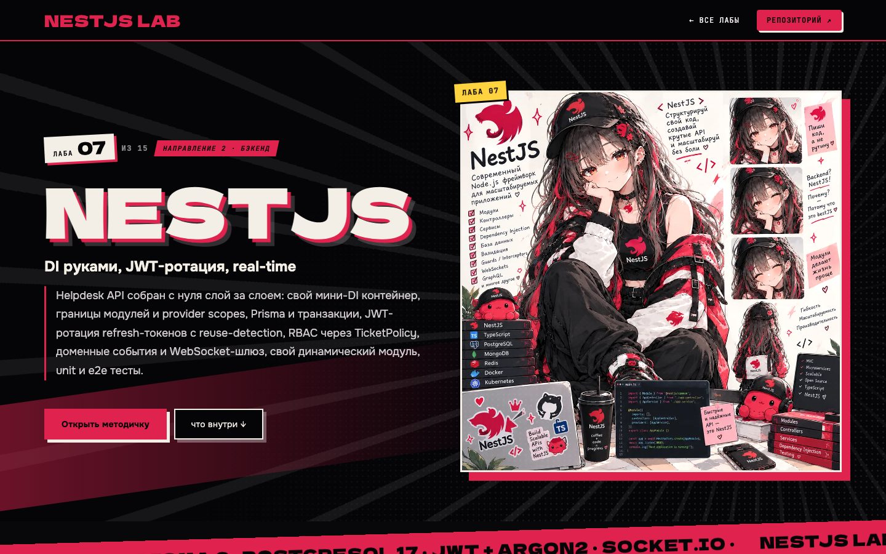
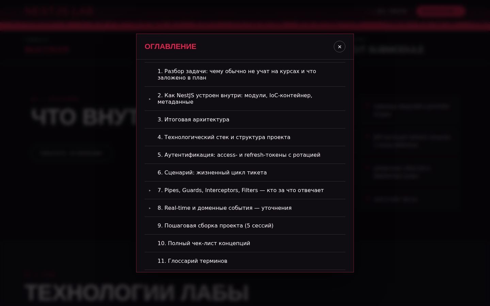
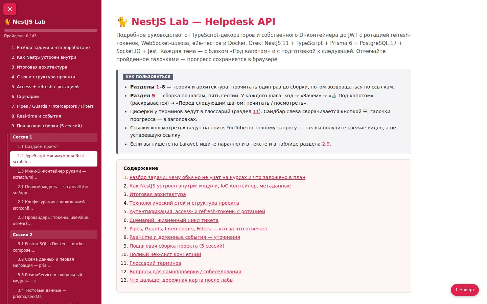

# Group Lab: Docker, Traefik, Kubernetes, PHP, OOP, RabbitMQ, Redis, Laravel, JS, Vue, TypeScript, NestJS, GraphQL, PostgreSQL


Сборный репозиторий с лабораторными работами. Каждая работа подключена как git submodule в отдельной папке и живёт в собственном репозитории — со своей историей коммитов, независимо от остальных. Репозиторий будет пополняться новыми работами.

Витрина всех работ и их описания — на [`index.html`](index.html) (открывается прямо в браузере или через GitHub Pages).

## Как это выглядит

На примере NestJS Lab: карточка на главной → страница лабы с описанием → оглавление методички → сама методичка.

| Карточки лаб на главной | Страница лабы |
|---|---|
|  |  |
| **Оглавление методички** | **Методичка** |
|  |  |

## Работы

Порядок — от простого к сложному, с учётом того, что лабы переиспользуют друг друга: OOP-лаба даёт фундамент для RabbitMQ и Laravel; «Чистый PHP» встал рядом с OOP, потому что тоже про язык, но без фреймворка (её ссылки на Laravel-лабу — в будущем времени, так как та ещё не пройдена). Kubernetes использует код `api/` из Traefik-лабы (в самой Kubernetes-лабе он тоже приведён целиком) — без пройденной Traefik-лабы не имеет смысла. RabbitMQ стоит пройти до Redis (методичка постоянно сравнивает Streams с брокером) и до Laravel-лабы (она ссылается на обе). «Чистый JS» — общий фундамент для Vue и TypeScript; Vue — до TypeScript (сессия 5 использует Vue). NestJS и GraphQL — самостоятельные проекты, каждый со своим доменом: NestJS не собирает бэкенд Vue-лабы (это отдельное изучение технологии с нуля, домен Helpdesk похож на Vue Lab только по смыслу), а GraphQL не требует прохождения NestJS. PostgreSQL — тоже самостоятельная: разбирает то, что во всех остальных лабах пряталось за ORM, поэтому её можно проходить в любой момент, но полезнее всего — после одной-двух лаб с Laravel, когда Eloquent уже знаком. Docker и Traefik самодостаточны и не завязаны на остальные.

> **Аудит и вычитка (24.09–26.09.2026).** Все 14 методичек вычитаны построчно и исправлены, проверены стыки между лабами (DevOps, фронтенд, бэкенд). PostgreSQL Lab добавлена позже (25.09) и вычитана следом (26.09); RabbitMQ Lab (пройдена пользователем без замеченных ошибок) вычитана дополнительно (26.09) — тоже нашлось что поправить. Находки, принятые решения и инструкция для повторной вычитки — в [`fixes/`](fixes/README.md), хронология — в [changelog](changelog.html).

| № | Папка | Лаба | Сложность | Репозиторий |
|---|---|---|---|---|
| 1 | [`docker`](docker) | Docker + Bash — крепкое владение с нуля | Базовая по входу, объёмная | [docker-lab](https://github.com/meeymirita/docker-lab) |
| 2 | [`php-coffee`](php-coffee) | OOP на PHP/Laravel — Coffee Shop API | Базовая по материалу | [oop-lab](https://github.com/meeymirita/oop-lab) |
| 3 | [`php`](php) | Чистый PHP — свой роутер, DI-контейнер, PDO, CSRF | Базовая по материалу | [php-lab](https://github.com/meeymirita/php-lab) |
| 4 | [`traefik`](traefik) | Traefik — reverse proxy, service discovery, TLS | Низкая–средняя | [traefik-lab](https://github.com/meeymirita/traefik-lab) |
| 5 | [`kubernetes`](kubernetes) | Kubernetes — от Compose к оркестрации | Средняя–высокая | [kubernetes-lab](https://github.com/meeymirita/kubernetes-lab) |
| 6 | [`rabbitmq`](rabbitmq) | RabbitMQ — Transactional Outbox, воркеры, DLQ | Высокая | [rabbitmq-lab](https://github.com/meeymirita/rabbitmq-lab) |
| 7 | [`redis`](redis) | Redis — кэш, локи, rate limit, Streams | Средняя | [redis-lab](https://github.com/meeymirita/redis-lab) |
| 8 | [`js`](js) | Чистый JS — Vanilla Helpdesk, фундамент без фреймворка | Средняя | [js-lab](https://github.com/meeymirita/js-lab) |
| 9 | [`vue`](vue) | Vue 3 — Helpdesk (Router, Pinia, WebSocket, тесты) | Высокая | [vue-lab](https://github.com/meeymirita/vue-lab) |
| 10 | [`typescript`](typescript) | TypeScript 5 — Warehouse (generics, Zod, API + Vue) | Высокая | [typescript-lab](https://github.com/meeymirita/typescript-lab) |
| 11 | [`nestjs`](nestjs) | NestJS — Helpdesk API с нуля (свой DI, JWT-ротация, WebSocket) | Высокая | [nestjs-lab](https://github.com/meeymirita/nestjs-lab) |
| 12 | [`graphql`](graphql) | GraphQL — CineGraph, самостоятельный проект (резолверы, DataLoader, Subscriptions) | Высокая | [graphql-lab](https://github.com/meeymirita/graphql-lab) |
| 13 | [`laravel`](laravel) | Laravel 13 изнутри — TaskFlow (таск-трекер с ролями) | Высокая | [laravel-lab](https://github.com/meeymirita/laravel-lab) |
| 14 | [`postgresql`](postgresql) | PostgreSQL — Coffee Shop изнутри (EXPLAIN, индексы, изоляция, блокировки, MVCC) | Средняя–высокая | [postgresql-lab](https://github.com/meeymirita/postgresql-lab) |

> Личный прогресс (моя пометка, не часть плана репозитория): ✅ пройдено — RabbitMQ. 🔵 сейчас прохожу — OOP (`php-coffee`).

---

## 1. Docker Lab (`docker/`)

> **Сложность: базовая по входу, но объёмная.** Не требует предыдущих лаб — рассчитана на полных новичков в контейнерах; Bash даётся параллельно, ровно в том объёме, который нужен для entrypoint-скриптов.

**О чём:** Docker и Bash разобраны подробно и с нуля — то, на что в Traefik-лабе был выделен всего один вводный раздел. Только сам Docker (образы, контейнеры, Dockerfile, тома, сети, Compose) и Bash как параллельный трек.

**Стек:** Node.js (Express) + PostgreSQL, всё в Docker / Docker Compose.

**Формат:** методичка `Docker_Bash_Lab.html` — методичка готова, прохождение впереди.

**Что внутри (3 сессии):** разбор Docker с нуля (образ vs контейнер vs Dockerfile), Bash параллельным треком (shebang, переменные, циклы, `set -e -u -o pipefail`), ENTRYPOINT vs CMD, тома и сети, Docker Compose (`depends_on` + healthcheck) — пошаговая сборка маленького Node.js + PostgreSQL проекта, заканчивается явной точкой возврата к Traefik Lab.

---

## 2. OOP Lab (`php-coffee/`)

> **Сложность: базовая по материалу** (нужен только синтаксис PHP, фреймворк — с сессии 5), но именно здесь стоит не спешить, если ООП пока даётся тяжело: это фундамент, который потом всплывает во всех остальных лабах.

**О чём:** объектно-ориентированное программирование на PHP 8.4 с нуля — не абстрактно, а на маленьком API кофейни. Отдельный, ни от чего не зависящий проект (в отличие от Redis/RabbitMQ-лаб не растёт из общей системы заказов).

**Стек:** Laravel 13 (PHP 8.4) + PostgreSQL 17 + RabbitMQ + Mailpit — брокер появляется только в последней сессии.

**Формат:** методичка `OOP_Lab_CoffeeShop.html` (вычитана и исправлена 24.09) — ниже план по оглавлению. Первая сессия начинается с чистого PHP без фреймворка, чтобы увидеть ООП "без магии Laravel".

**Что внутри (5 сессий):**
- **Сессия 1** — касса на массивах (и почему это плохо) → первый объект `Money` → `abstract class Drink` + `enum` + полиморфизм → заказ с инвариантами
- **Сессия 2** — тесты для `Money`; иерархия напитков-наследников; фабрика `DrinkType` + `GET /api/menu`
- **Сессия 3** — интерфейс `Beverage`; паттерн **Decorator** для добавок (сироп, шот и т.д.); сущность `Order` + `OrderStatus`; Repository + `POST /api/orders`
- **Сессия 4** — `DiscountPolicy` + `Clock`; чекаут со стратегиями оплаты (`PaymentMethod`) + `/pay`; тесты на стратегиях; эксперимент "а если бы делали через наследование" (чтобы почувствовать разницу с композицией)
- **Сессия 5** — `EventPublisher` + событие `order.paid`; воркеры (бариста + уведомления) на RabbitMQ (один topic-exchange, две очереди — подробно эту схему разберёте позже в RabbitMQ-лабе); сквозной тест без БД и без брокера; финал "до/после"

Проходит через: 4 принципа ООП, `abstract class` vs `interface`, наследование vs композиция, паттерны (Factory, Decorator, Strategy, Repository), SOLID — всё на одном сквозном примере.

---

## 3. Чистый PHP Lab (`php/`)

> **Сложность: базовая по материалу** (нужен только синтаксис PHP и пройденная OOP-лаба — её принципы используются без повторного объяснения), но ближе к концу ощутимо прибавляет: сессии 1–4 — язык, сессии 5–8 — своя инфраструктура (роутер, DI-контейнер, PDO, CSRF).

**О чём:** чистый PHP 8.4 без единого фреймворка — то, что обычно прячет Laravel: `strict_types` и copy-on-write массивы, суперглобалы, исключения, замыкания и генераторы, магические методы, современный синтаксис (`match`, nullsafe), Composer и PSR-4 — и дальше своими руками: роутер, DI-контейнер, PDO-слой, сессии/CSRF. Домен — та же кофейня, что в OOP-лабе, но здесь пишется инфраструктура, которую там давал фреймворк.

**Стек:** PHP 8.4 CLI, встроенный dev-сервер, PostgreSQL через голый PDO, Composer только для автозагрузки (PSR-4) — без единого стороннего пакета до сессии 7.

**Формат:** методичка `PHP_Lab_VanillaCoffee.html` — готова, прохождение впереди.

**Что внутри (8 сессий):**
- **Сессия 1** — стенд; `declare(strict_types=1)` + таблица `==` (чем PHP 7 отличается от PHP 8)
- **Сессия 2** — copy-on-write массивов на измерении момента копирования; `array_filter` vs `usort` (ключи, мутация); `mb_*` на кириллице + `sprintf` + regex
- **Сессия 3** — предсказать → проверить: `$_GET` и приведение типов; `php://input` — JSON-тело запроса; `finally` vs exception handler — порядок выполнения
- **Сессия 4** — `use ($var)` vs `use (&$var)` в замыканиях; генератор vs жадное чтение — измеряем память; свой фасад через `__callStatic`; `match` + nullsafe на неполных данных
- **Сессия 5** — PSR-4: автозагрузка до и после; свой роутер v1 (наивный) → v2 (regex-параметры)
- **Сессия 6** — боль без DI-контейнера (ручное связывание) → контейнер v1 (явные фабрики + singleton) → v2 (autowiring через Reflection)
- **Сессия 7** — SQL-инъекция: найти → исправить; транзакция с `rollBack` после частичного сбоя; CSRF своими руками (сессия + `hash_equals`); свой `.env`-парсер
- **Сессия 8** — финал: сборка `index.php`, middleware-цепочка, тесты + таблица «что даёт Laravel»

Разделы 1–12 методички — теория языка и рантайма, раздел 13 — восемь сессий заданий, разделы 14–17 — чек-лист, глоссарий, вопросы для собеседования, что дальше.

---

## 4. Traefik Lab (`traefik/`)

> **Сложность: низкая–средняя** (инфраструктурная, не про код — backend/frontend уже даны готовыми). Нужно перед стартом: Docker Compose на уровне «поднять сервис и почитать логи»; для новичков в контейнерах есть отдельный вводный раздел 0.

**О чём:** reverse proxy и service discovery для стека из нескольких сервисов — без ручной правки конфигов при каждом деплое, через Docker-labels.

**Стек:** Traefik 3 + Docker Compose (с заметками про Podman) + Node.js API + статический frontend + PostgreSQL + Adminer.

**Формат:** методичка `Docker_and_Traefik_Lab_Plan.html` — не пройдена, ниже план по оглавлению. Есть отдельный раздел 0 "Введение в Docker с нуля" для тех, кто раньше не работал с контейнерами.

**Что внутри (3 сессии):**
- **Сессия 1** — каталоги и `traefik/traefik.yml`; базовый `docker-compose.yml`; первый роутер через labels на тестовом сервисе `whoami`; dashboard Traefik и его защита; заметка про rootless Podman
- **Сессия 2** — backend API; frontend с path-routing (`StripPrefix`); PostgreSQL + Adminer за прокси; масштабирование API + healthcheck; цепочка middlewares
- **Сессия 3** — TLS через `mkcert` (локально) и Let's Encrypt (staging); canary-деплой (weighted round robin); "Production Hell" — финальный сценарий без подсказок

Модель для понимания: `EntryPoint → Router → Middleware → Service` — весь курс выстроен вокруг этой цепочки.

---

## 5. Kubernetes Lab (`kubernetes/`)

> **Сложность: средняя–высокая.** Нужны пройденные Docker Lab и Traefik Lab — сюда переносится ровно их стек (API + frontend + PostgreSQL + Adminer), поэтому новый домен не изучается, а сразу нужны настоящие понятия Kubernetes. Нужен код `api/` из Traefik-лабы (Dockerfile, server.js, package.json — в самой Kubernetes-лабе он тоже приведён целиком).

**О чём:** миграция уже знакомого стека из `docker-compose.yml` в Kubernetes, шаг за шагом — видно именно то, что меняется при переходе от одной машины к оркестрации, а не тонет в шуме нового кода. Кластер — [kind](https://kind.sigs.k8s.io/) (Kubernetes IN Docker): настоящий control plane и worker-узлы в контейнерах, тот же `kubectl` и те же объекты, что и в проде.

**Стек:** Kubernetes (kind) + kubectl + Traefik как Ingress-контроллер (IngressRoute CRD) — тот же стек приложения, что в Traefik Lab: Node.js API + статический frontend + PostgreSQL 17 + Adminer. Проверено на kind v0.24.0 / Kubernetes v1.31.0.

**Формат:** методичка [`Kubernetes_Lab_Plan.html`](kubernetes/Kubernetes_Lab_Plan.html) — открывается в браузере, прогресс по чекбоксам сохраняется локально.

**Что внутри (3 сессии):**
- **Сессия 1** — kind-кластер; первый Pod руками и его смертность; Deployment и самолечение через ReplicaSet; сборка образа API и `kind load`; Service и стабильный адрес поверх набора Pod'ов
- **Сессия 2** — полный стек: ConfigMap/Secret вместо `.env`; Volumes и PersistentVolumeClaim для PostgreSQL; readiness/liveness-пробы; requests/limits
- **Сессия 3** — Traefik снаружи кластера через IngressRoute CRD; HorizontalPodAutoscaler вместо ручных "x3 реплики"; "Production Hell" — финальный сценарий без подсказок

Разделы 1–8 методички — теория (Control Plane/Node, Pod, Deployment, Service, ConfigMap/Secret, Volumes, Probes, Traefik как Ingress-контроллер), раздел 9 — три сессии заданий, разделы 10–13 — чек-лист, глоссарий, вопросы для собеседования, что дальше.

---

## 6. RabbitMQ Lab (`rabbitmq/`)

> **Сложность: высокая.** Нужно перед стартом: уверенный Laravel/PHP (транзакции, Artisan-команды, очереди хотя бы на уровне концепции), базовые транзакции SQL, Docker Compose «запустить и посмотреть логи».

**О чём:** асинхронная обработка заказов интернет-магазина через очереди, с упором на паттерны надёжной доставки — то, что в реальных системах спасает от потери и дублирования сообщений.

**Стек:** Laravel 13 (PHP 8.4) + PostgreSQL 16 + RabbitMQ (Management UI) + Mailpit, всё в Docker Compose.

**Архитектура:** HTTP-запрос создаёт заказ и **сразу** пишет "записку" о событии в таблицу `outbox_messages` — в той же транзакции БД (паттерн **Transactional Outbox**, чтобы не потерять событие, если публикация в брокер упадёт). Отдельный процесс `outbox-relay` забирает записки и публикует их в exchange `orders.topic`. Дальше три независимых воркера (`order-worker`, `email-worker`, `analytics-worker`) разбирают свои копии сообщения из очередей: резервируют склад, шлют письмо, пишут в аналитику.

**Что пройдено (все 3 сессии):**
- Хопы 1–8: путь заказа от HTTP до БД, шаг за шагом, с точками наблюдения (`dd()`, логи, RabbitMQ UI)
- Что происходит, когда не хватает товара на складе
- **Идемпотентный consumer**: таблица `processed_messages` защищает от повторной обработки при redelivery
- Competing consumers + **prefetch** (`basic_qos`) — честное распределение нагрузки vs эффект "воркера-заложника" при большом prefetch
- Crash-тесты: `docker compose kill` (грубое убийство) и падение **после коммита, но до `ack`** — на практике поймали баг с `SIGKILL` на PID 1 в контейнере (ядро Linux его игнорирует), заменили на `exit()`
- **Retry с TTL → DLX** для писем: `email.retry.1/2/3` (10с/30с/300с) → `email.dlx` → назад в `email.queue` или в `email.dlq` после исчерпания попыток
- Читатель DLQ (`worker:failed-email`) — ручной разбор "мёртвых" сообщений
- Сравнение с нативными Laravel Queue Jobs (`$tries`/`$backoff`/`failed_jobs`) на том же RabbitMQ — чтобы почувствовать, где ручной AMQP-слой даёт то, чего нет из коробки (идемпотентность, publisher confirms, чужие consumer'ы не на Laravel)
- **Priority queues** (`x-max-priority`) с backlog — почему приоритет виден только при накопленной очереди
- **Fanout** (`lab:broadcast` / `worker:broadcast`) — широковещание всем подписчикам через `system.broadcast`, в отличие от topic-маршрутизации остального проекта

**Пример выполнения — в самом репозитории `rabbitmq-lab` (сабмодуль `rabbitmq/`):**
- рабочий код всех воркеров и команд — `laravel-app/app/Console/Commands/`
- пошаговый разбор пути заказа (хопы, точки наблюдения, что смотреть в БД/UI/логах) — [`docs/order-path-explained.md`](https://github.com/meeymirita/rabbitmq-lab/blob/main/docs/order-path-explained.md)
- ответы на все 18 вопросов для самопроверки, привязанные к коду проекта — [`docs/self-check-answers.md`](https://github.com/meeymirita/rabbitmq-lab/blob/main/docs/self-check-answers.md)
- подборка справочных материалов по темам лабы — [`docs/rabbit.md`](https://github.com/meeymirita/rabbitmq-lab/blob/main/docs/rabbit.md)

---

## 7. Redis Lab (`redis/`)

> **Сложность: средняя.** Нужно перед стартом: то же, что для RabbitMQ-лабы (Laravel, Docker), домен заказов переиспользуется. Рекомендуется после RabbitMQ Lab: методичка постоянно сравнивает Streams с брокером.

**О чём:** Redis как кэш, хранилище сессий, примитив синхронизации и брокер событий — одновременно, на кусочке той же системы заказов. Лаба специально показывает, где каждая из этих ролей "подводит" (что будет при рестарте без AOF, при отвале Pub/Sub-подписчика, при гонке за один и тот же лок).

**Стек:** Laravel 13 + PostgreSQL 17 + Redis 7.

**Формат:** методичка `Redis_Lab_Plan.html` (открывается в браузере, прогресс по чекбоксам сохраняется локально) — ещё не пройдена, ниже план по оглавлению.

**Что внутри (3 сессии):**
- **Сессия 1** — docker-compose и `redis.conf`, Laravel + `.env`, миграции; **Cache-Aside** для карточки товара (`ProductRepository`); сессии в Redis (`SESSION_DRIVER=redis`); `StreamPublisher` — первый producer в Redis Streams; первый consumer (happy path)
- **Сессия 2** — **distributed lock** (`SET NX PX`) в `StockReservationService`, чтобы не продать один товар дважды; **rate limiter** (sliding window); competing consumers + нагрузочный тест; crash-тест на **PEL** (Pending Entries List) и идемпотентность
- **Сессия 3** — retry через `XAUTOCLAIM`; ручной DLQ-поток; приоритет очереди через `ZSET`; Pub/Sub-дашборд в реальном времени; "Production Hell" — комплексный сценарий без подсказок

Логика подачи материала зеркалит RabbitMQ-лабу (архитектура → сборка по шагам → "под капотом" → что почитать перед следующим шагом), но через призму структур данных Redis вместо AMQP.

---

## 8. Чистый JS Lab — Vanilla Helpdesk (`js/`)

> **Сложность: средняя.** Не требует предыдущих лаб — нужен только базовый синтаксис JS. Это общий фундамент для Vue Lab и TypeScript Lab, поэтому логично проходить её первой из трёх.

**О чём:** JavaScript с нуля, без единого фреймворка и без бандлера — то, что Vue и другие фреймворки обычно прячут: как на самом деле работают `var`/`let`/`const` и hoisting, `this` и замыкания, прототипы под капотом `class`, event loop, DOM и модули. Домен практики (тикеты) намеренно совпадает с Vue Lab — Helpdesk, чтобы в финале явно сравнить «vanilla vs Vue»; код при этом полностью свой, без единой связи с тем репозиторием.

**Стек:** JavaScript (ES2022+, без TypeScript и без сборки) + Node 22+ (24 LTS тоже подходит) для сессий-песочниц; в браузере — нативные ES-модули без бандлера; `json-server` как мок-API (только `db.json`, ноль кода); собственный ~15-строчный сервер на `node:http`; тесты — встроенный `node --test`; Docker (compose-файл создаётся в сессии 1).

**Формат:** методичка `JS_Lab_VanillaHelpdesk.html` — готова, прохождение впереди.

**Что внутри (8 сессий):**
- **Сессия 1** — переменные, область видимости, hoisting: воспроизведён и починен баг с `var` в цикле тремя способами
- **Сессия 2** — типы, приведение, объекты, массивы: рефакторинг императивного кода в функциональный на методах массивов
- **Сессия 3** — `this`, замыкания, паттерны: каррирование, мемоизация, приватность до и после `#private`
- **Сессия 4** — прототипы, `class`, `Symbol`, коллекции: цепочка прототипов руками → `class` → сравнение с `Map`/`Set`
- **Сессия 5** — event loop, Promises, fetch, debounce/throttle: своя очередь задач, реальный fetch к `json-server`, тесты на `node --test`
- **Сессия 6** — DOM без фреймворка: список тикетов рендерится и обновляется без единой строки фреймворка
- **Сессия 7** — модули (ESM), Storage, своя реактивность на `Proxy`
- **Сессия 8** — финал: мини-SPA (свой роутер на `history.pushState`, стор на `Proxy`, рендер шаблонными строками) с явной таблицей сравнения «что Vue даёт бесплатно»

Разделы 1–14 методички — теория языка и рантайма (от типичных багов без понимания фундамента до event loop, DOM и модулей), раздел 16 — восемь сессий заданий, разделы 17–20 — чек-лист, глоссарий, вопросы для собеседования, что дальше.

---

## 9. Vue Lab (`vue/`)

> **Сложность: высокая, если фронтенд — новая территория.** Нужно перед стартом: уверенный JavaScript (ES6+, async/await, деструктуризация); если сомневаетесь в фундаменте — сначала «Чистый JS» (`js/`). Опыт с Vue или другими фреймворками не требуется, готовый мини-бэкенд (Node) дан за вас.

**О чём:** Helpdesk (система тикетов) на Vue 3 с нуля — реактивность, компоненты, роутинг и общее состояние, каждое понятие на одном сквозном примере. Бэкенд (готовый мини-бэкенд на Node) дан в первой же сессии — писать его не нужно, только запустить.

**Стек:** Vue 3.5 + Vite 6+ + Vue Router 4 + Pinia 2+ + Vitest, бэкенд — готовый мини-бэкенд (Node). Composition API + `<script setup>` (Options API — только в теории для сравнения). Всё в Docker.

**Формат:** методичка `Vue_Lab_Helpdesk.html` — не пройдена, ниже план по оглавлению.

**Что внутри (5 сессий, порядок строгий — Pinia раньше Router, потому что guard'ам роутера нужен auth-store):**
- **Сессия 1** — стенд (`docker-compose`, скаффолд готового бэкенда и `create-vue`); готовый мини-бэкенд на Node (auth, tickets, comments, history, WebSocket-gateway) — дан готовым; песочница реактивности: `ref`/`reactive`/`computed`/`watch`, директивы, `v-model`, `v-for`/`key`; `useAsync` и первый запрос к API
- **Сессия 2** — разбор списка тикетов на компоненты: `StatusBadge`, `TicketCard`, `TicketList` (props/emits, слоты); `BaseModal` (слоты, Teleport, lifecycle, template refs); тосты через `provide`/`inject`; composable `useNow`/`RelativeTime`
- **Сессия 3** — Pinia: `state`/`getters`/`actions`, `storeToRefs`, auth-стор с токеном, persist-плагин; оптимистичная смена статуса тикета с откатом при ошибке
- **Сессия 4** — Vue Router: маршруты, lazy loading, `RouterLink`, guards (`requiresAuth`, роли, redirect после логина), вложенные маршруты, query-синхронизация, 404; страница тикета с вкладками, форма создания, `onBeforeRouteLeave`
- **Сессия 5** — WebSocket (`useSocket`) с живыми обновлениями через store; канбан-доска (`TransitionGroup`, `defineAsyncComponent`, динамический компонент); тесты на Vitest (компонент, composable, store, router guard); production-сборка и деплой за прокси

Главная мысль лабы: Vue — это реактивность + компоненты + экосистема (Router — состояние адресной строки, Pinia — общее состояние), и каждое задание про то, где живёт состояние и кто его меняет.

---

## 10. TypeScript Lab (`typescript/`)

> **Сложность: высокая** — абстрактное мышление на уровне типов (generics, conditional/mapped types) непривычно после динамического PHP. Нужно перед стартом: тот же JavaScript, что для Vue-лабы; логично проходить после или параллельно с ней (сессия 5 использует Vue).

**О чём:** типизация домена складского учёта (Warehouse) с нуля — без фреймворков до последней сессии, чтобы увидеть TypeScript в чистом виде и потом узнавать его в Nest/Vue. Что типы реально ловят (перепутанные аргументы, `NaN` от строки вместо числа, `undefined` в рантайме), а что — нет.

**Стек:** TypeScript 5.x (≥ 5.6) + Node 22+ (24 LTS тоже подходит) + `tsx` + Vitest + Zod, в финале — Express и Vue 3 + TS. Отдельный репозиторий на npm workspaces: `packages/core`, `cli`, `api`, `web`. Всё в Docker.

**Формат:** методичка `TypeScript_Lab_Warehouse.html` — не пройдена, ниже план по оглавлению. Каждый шаг заканчивается зелёным `npm run typecheck` — это главный критерий готовности.

**Что внутри (5 сессий, порядок строгий):**
- **Сессия 1** — стенд (Docker, workspaces, `tsconfig.base`, `tsx`, Vitest); песочница: аннотации, вывод типов, примитивы/объекты, union и литералы, `type` vs `interface`, функции, `any`/`unknown`/`never`, `strict`, `as const`
- **Сессия 2** — домен склада: branded IDs, размеченное объединение `Movement`, exhaustive `switch`, `Result` вместо исключений, type predicates, `readonly` — `applyMovement` с тестами, невозможные состояния невыразимы на уровне типов
- **Сессия 3** — generics и абстракции: `Repository<T>`, `TypedEmitter<Events>`, mapped/conditional/template literal types, `satisfies` — сервис `Warehouse`, собранный из типизированных кубиков
- **Сессия 4** — CLI: `parseArgs`, команды как union из template literal types, валидация через Zod и `z.infer`, `unknown` в `catch`, `.d.ts` для JS, сборка esbuild — рабочий `wh`: `item:add`, `stock:in/out/transfer/list/low`, `import:csv`
- **Сессия 5** — сквозная типизация: `ApiContract`, generic-клиент с conditional types, Express + Zod на бэкенде, Vue 3 + TS (`defineProps`/`defineEmits` с generics, типизированный store), `vue-tsc` — один источник типов и в API, и в браузере

---

## 11. NestJS Lab (`nestjs/`)

> **Сложность: высокая.** Проект полностью самостоятельный — не требует прохождения других лаб. TypeScript-минимум, нужный для Nest, объясняется по ходу в сессии 1. Это полное изучение NestJS с нуля как отдельной технологии: домен Helpdesk похож на Vue Lab только по смыслу, зависимости от неё нет.

**О чём:** Helpdesk API собирается с нуля слой за слоем, и на каждом шаге видно, что скрывает декоратор `@Injectable()`, когда его пишут не глядя: свой мини-DI контейнер и метаданные декораторов, границы модулей и provider scopes, DTO и `ValidationPipe`, Prisma и транзакции, JWT-ротация refresh-токенов с reuse-detection, RBAC и владение через `TicketPolicy`, доменные события, WebSocket-шлюз с комнатами и своей авторизацией на handshake, свой динамический модуль, unit- и e2e-тесты.

**Стек:** NestJS 11 + TypeScript (strict), Node 22+ (24 LTS тоже подходит), Prisma 6 + PostgreSQL 17, class-validator/class-transformer, `@nestjs/passport` + `passport-jwt` + `@nestjs/jwt` + argon2, `@nestjs/event-emitter`, `@nestjs/websockets` (Socket.IO), `@nestjs/swagger`, helmet + `@nestjs/throttler`, `@nestjs/terminus`, Jest + supertest. Всё в Docker.

> Prisma 6 в NestJS-лабе и Prisma 7 в GraphQL-лабе — намеренно: NestJS зафиксирована на 6, GraphQL показывает 7.

**Формат:** методичка [`NestJS_Lab_Plan.html`](nestjs/NestJS_Lab_Plan.html) — открывается в браузере, прогресс по чекбоксам сохраняется локально.

**Что внутри (5 сессий):**
- **Сессия 1** — фундамент: TypeScript-минимум для Nest, DI руками (свой мини-контейнер), модули, конфиг с валидацией
- **Сессия 2** — база данных: Docker, Prisma и первая миграция, DTO и `ValidationPipe`, CRUD тикетов, ошибки Prisma в HTTP, транзакции и история изменений
- **Сессия 3** — пользователи и безопасность: регистрация и хэши (argon2), логин и `JwtStrategy`, глобальный guard и `@Public()`/`@CurrentUser()`, refresh-токены с ротацией и reuse-detection, роли и владение (`TicketPolicy`)
- **Сессия 4** — комментарии и внутренние заметки, доменные события, WebSocket-шлюз с комнатами, middleware/interceptors, Swagger, безопасность (CORS, helmet, rate limit)
- **Сессия 5** — unit- и e2e-тесты, свой динамический модуль, health-чеки и graceful shutdown, Docker, "Production Hell" — финальный сценарий без подсказок

Разделы 1–8 методички — теория (разбор задачи, как NestJS устроен внутри, итоговая архитектура, стек и структура, access/refresh-аутентификация, сценарий жизненного цикла тикета, Pipes/Guards/Interceptors/Filters, real-time и доменные события), раздел 9 — пять сессий заданий, разделы 10–13 — чек-лист, глоссарий, вопросы для собеседования, что дальше.

---

## 12. GraphQL Lab (`graphql/`)

> **Сложность: высокая.** Проект полностью самостоятельный (свой репозиторий `graphql-lab`), ни от одной другой лабы не зависит — домен другой (каталог фильмов, а не Helpdesk). Из знаний пригодятся основы NestJS (модули, DI, декораторы) и TypeScript на уровне «классы, интерфейсы, async/await» — всё остальное объясняется по ходу.

**О чём:** CineGraph — каталог фильмов, режиссёров и рецензий, спроектированный так, чтобы естественно упереться во все ключевые темы GraphQL: язык запросов и жизненный цикл запроса, N+1 в резолверах и `DataLoader`, JWT и права на уровне полей, интерфейсы и юнионы (фильмография, поиск), курсорная пагинация рецензий (Relay Connection), подписки на живую ленту через Redis, защита от тяжёлых запросов (depth limit + query complexity).

**Стек:** NestJS + `@nestjs/graphql` + Apollo Server (code-first: `@ObjectType`/`@Field`/`@Resolver`), Prisma 7 + PostgreSQL 17, `dataloader` для батчинга, `@nestjs/jwt` + bcryptjs, `graphql-subscriptions`/`graphql-redis-subscriptions` + Redis, `graphql-query-complexity`. Всё в Docker.

**Формат:** методичка [`GraphQL_Lab_Plan.html`](graphql/GraphQL_Lab_Plan.html) — открывается в браузере, прогресс по чекбоксам сохраняется локально.

**Что внутри (3 сессии):**
- **Сессия 1** — инфраструктура и схема: репозиторий и NestJS, docker-compose (Postgres + Redis), модель данных и seed, первые `ObjectType`/`Query`, резолверы полей наивно, воспроизводим и считаем N+1, input-типы
- **Сессия 2** — DataLoader, мутации, ошибки, права, полиморфизм: DataLoader на каждый запрос, вычисляемые поля, JWT-мутации, мутации рецензий с guard и владением, формат ошибок и маскировка, права на уровне полей и ролей, интерфейсы и юнионы, курсорная пагинация
- **Сессия 3** — подписки, Redis, защита, тесты: живая лента рецензий, два инстанса и Redis Pub/Sub, клиент без библиотек (`fetch` + `graphql-ws`), depth limit и query complexity, unit- и e2e-тесты, "Production Hell" — финальный сценарий без подсказок

Разделы 1–8 методички — теория (типичные заблуждения о GraphQL, как GraphQL устроен внутри, итоговая архитектура, стек и структура, N+1 и DataLoader, сценарий жизни одной рецензии, ошибки и nullability, пагинация/безопасность/кэш), раздел 9 — три сессии заданий, разделы 10–13 — чек-лист, глоссарий, вопросы для собеседования, что дальше.

---

## 13. Laravel Lab (`laravel/`)

> **Сложность: высокая.** Нужно перед стартом: базовый Laravel (роутинг, контроллеры, миграции, Blade — даются ссылками на документацию, без разбора), ООП на PHP (см. `php-coffee/`) и общее представление про очереди (см. `rabbitmq/`) — лаба на них ссылается, а не объясняет заново.

**О чём:** Laravel 13 "изнутри" — не "как вызвать", а что происходит на каждом слое фреймворка (~30 компонентов `illuminate/*`, связанных через контейнер), на сквозном таск-трекере **TaskFlow** с воркспейсами, ролями и приглашениями.

**Стек:** Laravel 13 (PHP 8.4) + PostgreSQL 17 + Redis 7 + RabbitMQ 4 + Mailpit + Laravel Reverb; фронт — Vue 3 + Vite (JavaScript, только API-клиент). Всё в Docker.

**Формат:** методичка `Laravel_Lab_TaskFlow.html` — не пройдена, ниже план по оглавлению.

**Что внутри (10 сессий):**
- **Сессия 1** — стенд (Docker, Laravel 13, Sanctum/Reverb/RabbitMQ-драйвер), схема данных и миграции
- **Сессия 2** — Eloquent: связи, pivot, N+1 — разбираем боль по шагам (`hasMany`/`belongsTo`, `belongsToMany` + свой Pivot-класс, `attach`/`sync`/`toggle`, полиморфные связи, `hasManyThrough`)
- **Сессия 3** — коллекции (`groupBy`/`partition`/`reduce`/`keyBy`), API Resources (`whenLoaded`/`whenCounted`), три вида пагинации
- **Сессия 4** — HTTP-слой: Form Requests, своё middleware с параметром, обработка исключений API, полноценный CRUD задач
- **Сессия 5** — Service Container и провайдеры: `build`/`bind`/`call` изнутри, contextual binding (`when`/`needs`/`give`)
- **Сессия 6** — Auth: Sanctum SPA (cookie + CSRF), Gate и Policy, роли, приглашения по токену + минимальный Vue-фронт (логин, доска)
- **Сессия 7** — Observer (жизненный цикл модели), события и Listeners, Job (retry, `ShouldBeUnique`, `failed_jobs`) на RabbitMQ — та же схема, что в RabbitMQ-лабе
- **Сессия 8** — Mailable (markdown-письма, очередь), Notification (mail + database), Scheduler (дайджест задач)
- **Сессия 9** — `Cache::remember` + инвалидация в Observer, `Cache::lock` от гонки, RateLimiter, Broadcasting через Reverb + Echo
- **Сессия 10** — фабрики для всех моделей, feature-тесты (`RefreshDatabase`), fakes/моки (Event/Notification/Mail), финальный прогон

Лаба построена вокруг карты Laravel (`Kernel → Middleware → Router → Controller`, плюс сквозные Container/Events/Auth и менеджеры Database/Cache/Queue/Mail/Broadcasting) и проходит по каждому слою последовательно — от жизненного цикла запроса до тестов.

---

## 14. PostgreSQL Lab (`postgresql/`)

> **Сложность: средняя–высокая.** Проект полностью самостоятельный (свой репозиторий `postgresql-lab`, только SQL-файлы и `docker-compose.yml`), ни от одной другой лабы не зависит — общая с OOP- и PHP-лабами только идея «кофейни». Входной уровень — «умею SELECT/INSERT»; если JOIN пока «тёмный лес», есть вводная сессия 0. Параллели с Laravel/Eloquent даны по ходу, но фреймворк знать не обязательно.

**О чём:** Postgres есть почти в каждой лабе, но везде он был «чёрным ящиком за ORM». Здесь — то, что происходит под ORM, на базе кофейни с реальным объёмом данных (20 кофеен, 100 000 клиентов, 1 000 000 заказов, 2,5 млн позиций, 3 млн событий): устройство Postgres изнутри (процессы, страницы, shared buffers, WAL, планировщик), чтение `EXPLAIN (ANALYZE, BUFFERS)`, индексы под конкретный запрос (B-tree, частичные, функциональные, покрывающие, GIN, BRIN), статистика, N+1 глазами базы, изоляция и аномалии, блокировки и дедлоки, MVCC и VACUUM, партиционирование.

**Стек:** PostgreSQL 17 в Docker + `psql` + `pgbench`; расширения `pg_stat_statements`, `pg_trgm`, `pageinspect`, `btree_gist`. Никакого фреймворка и ORM.

**Формат:** методичка [`PostgreSQL_Lab_CoffeeShop.html`](postgresql/PostgreSQL_Lab_CoffeeShop.html) — методичка готова, прохождение впереди. У каждого шага — «Под капотом» и тренировка с ответами под спойлером; главный артефакт — журнал `NOTES.md` с планами «до/после».

**Что внутри (7 сессий):**
- **Сессия 0** — JOIN с нуля на песочнице из пяти клиентов и семи заказов: INNER/LEFT/RIGHT/FULL, ловушка «условие в WHERE», self-join, anti- и semi-join, JOIN + GROUP BY
- **Сессия 1** — Postgres в Docker с инструментами наблюдения, `psql` как рабочее место, схема кофейни, миллион заказов за минуту, SQL-инструментарий (CTE, оконные функции, FILTER, LATERAL), как таблица лежит на диске
- **Сессия 2** — EXPLAIN и B-tree: от Seq Scan на миллион строк до 20 прочитанных записей, составные индексы, статистика, частичные, функциональные и покрывающие индексы
- **Сессия 3** — алгоритмы JOIN и `work_mem`, GIN и BRIN, расширенная статистика, N+1 через `pg_stat_statements`, пагинация, охота на медленные запросы
- **Сессия 4** — транзакции и изоляция: потерянное обновление через `pgbench`, Read Committed, Repeatable Read, Serializable и write skew, ограничения как последняя линия обороны
- **Сессия 5** — блокировки: `FOR UPDATE`, очередь на `SKIP LOCKED`, дедлок, `pg_blocking_pids()`, миграции без простоя, advisory locks
- **Сессия 6** — MVCC и VACUUM изнутри (`pageinspect`, `xmin`/`xmax`, горизонт, HOT, wraparound), партиционирование журнала событий, "Production Hell" — задания без подсказок

Разделы 1–8 методички — теория (чего не видно из ORM, как PostgreSQL устроен внутри, архитектура и схема данных, стек и структура, индексы, как читать EXPLAIN, транзакции и блокировки, MVCC/VACUUM/партиционирование/N+1), раздел 9 — семь сессий заданий, разделы 10–13 — чек-лист, глоссарий, вопросы для собеседования, что дальше.

---

## Витрина работ (`works/`)

Отдельный сабмодуль [`works-lab`](https://github.com/meeymirita/works-lab) со стилизованными обзорными страницами каждой лабы (тёмный неоновый дизайн, тот же, что и у [`index.html`](index.html)): что внутри, стек, куда открыть методичку и репозиторий. Там же лежат превью-картинки лаб (`works/images/`), которые использует и главная страница.

Открыть можно прямо по ссылке `works/<ключ-лабы>.html`, например [`works/rabbitmq.html`](works/rabbitmq.html).

---

## Клонирование

Репозиторий использует submodule, поэтому клонировать нужно с флагом `--recurse-submodules`:

```bash
git clone --recurse-submodules https://github.com/meeymirita/submodule-group-lab.git
```

Если репозиторий уже склонирован без этого флага:

```bash
git submodule update --init --recursive
```

## Добавление новой работы

```bash
git submodule add <url-репозитория-лабы> <папка>
git commit -m "Add <название> lab"
```

## Обновление сабмодуля до последнего коммита

```bash
cd <папка-лабы>
git pull origin main
cd ..
git add <папка-лабы>
git commit -m "Update <папка-лабы> submodule"
```

## Автор

Все лабы веду и прохожу самостоятельно, попутно ведя заметки и методички по каждой теме.
